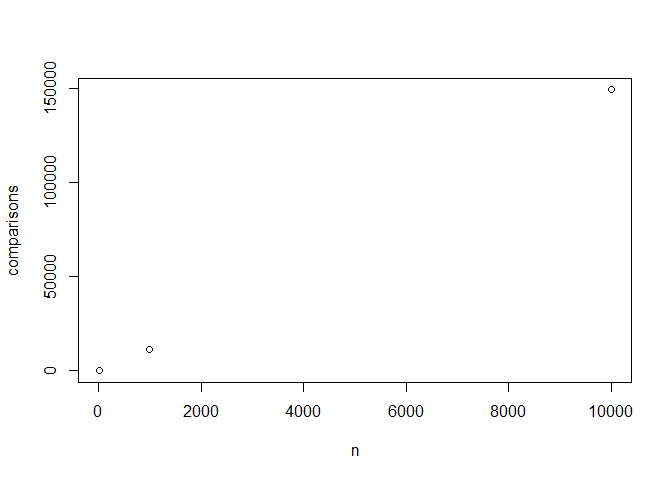
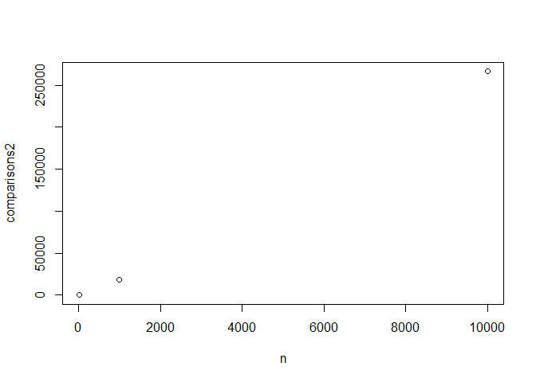

Workshop 8
================
Sawyer Welden
October 26, 2017

I used R Markdown to write the writeup because 1) It's easy and 2) It's fun and can make my plots for me. Also, I used a linux machine for this assignment and I don't know a correlary to MS Paint that I could use to manipulate the graph files given in the assignment. I'm sure I could find one, but this is due now.

1 - 3
-----

I altered the code as was asked and when running frequency counter on the tiny txt file, the program reported 36 comparisons.

To handle the problem of limiting the frequency counter to N lines, I added a second command line argument called maxWords. This makes it easy to test by using lines such as

``` r
#         java FrequencyCounter 8 2000 < leipzig1M.txt
```

which is used for N = 2000.

``` r
n = c(10,1000,10000)
comparisons = c(38,11610,149107)
plot (comparisons ~ n)
```



4
-

To count comparisons I needed to add a member to RedBlackBST and also change one line of code in FrequencyCounter.

``` r
comparisons2 <- c(61, 18044, 266330)
plot (comparisons2 ~ n)
```



5
-

I realize now I used n = 10 rather than 100, and I've written over the version of freq counter with BST, but we can extrapolate what we need. Comparisons is for BST, and comparisons2 is for RedBlackBST. When N grows by a factor of 10, comparisons grows by a factor of 12.8 and comparisons2 14.8 These are both greater than 10, so the function grows at least as fast as N, leading me to believe that both are aNb.

``` r
x <- cbind(n,comparisons,comparisons2)
library(knitr)
kable(x, caption = "N | BST | RedBlackBST")
```

|      n|  comparisons|  comparisons2|
|------:|------------:|-------------:|
|     10|           38|            61|
|   1000|        11610|         18044|
|  10000|       149107|        266330|

6
-

If the words in the file had been truly random, there would be a greater variety of words, so there would be less frequency of each word.
