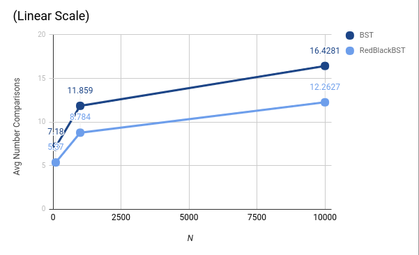
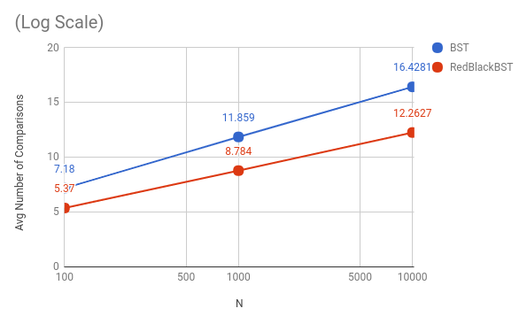

# Analyzing the Rate of Growth

From graph LinearScale, it looks like both BST and the RedBlackBST both grow at a rate of alogN at first glance. To check this hypothesis, I graphed the same graph but with log scale (graph LogScale).

Because the trend is linear for both BST and the RedBlackBST in log scale, it means that the rate of growth is alogN. However, the a constant for the RedBlackBST is less than that for the BST because the slope is less steep.

# Reflection on the Results

**The words in the file are not completely random. (They're random English sentences.)** **_How would the results have been different on random input?_**

Although the words are not completely random, they are still random English sentences. Words in random English sentences are not already sorted alphabetically or reversely sorted alphabetically. Thus, although not completely random, the inputs still have a degree of randomness. Therefore, the results would have been about the same on "random input."

**_What do the results say about the depths of the trees that were created - the BST vs. the depth of the RedBlackTree_**

Because the number of comparisions for the RedBlackTree was less than that of the BST, the depth of the RedBlackTree was smaller than that of the BST